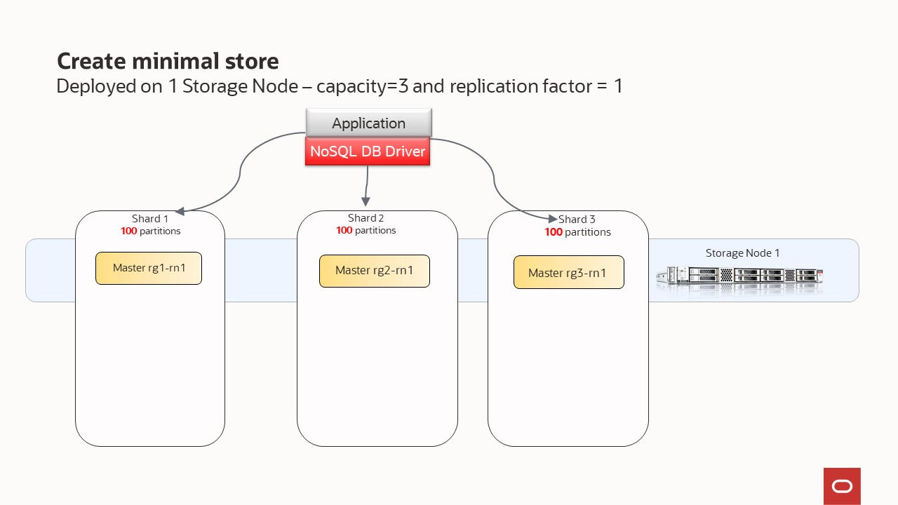

# Scenario 1 - deploy a single node - non-secure cluster

This is the simplest scenario, only one Storage node. It is for **test only** and not for production that requires HA and business continuity.

Every **Storage Node** hosts one or more **Replication Nodes** as determined by its **capacity**. A Storage Node's capacity serves as a rough measure of the 
hardware resources associated with it (memory, CPUs, and disks). Stores can contain Storage Nodes with different capacities, and Oracle NoSQL Database
ensures that a Storage Node is assigned a proportional load size to its capacity.  As a general guideline, we want each **Replication Node** to have its own disk 
and approximately 40GB RAM maximum.  For example, if your **Storage Node** has 128 GB RAM and 2 disks, then this **Storage Node** can support 
2 **Replication Nodes** even though it has enough memory to support 3.  For this example, consider adding another disk driver to the **Storage Node**.

Your store is organized into **shards**, and **shards** contain replication nodes.  Replication nodes hold a subset of the store's data. There are two 
types of replication nodes, namely, **masters** and **replicas.** 
Each shard must contain one **master** node. The master node performs all database write activities. Each shard can also contain one or more read-only **replicas**.
The master node copies all new write activity data to the replicas. The replicas are then used to service read-only operations.  The total number of 
masters and replicas in a shard are equal to the replication factor (RF).  You can also think of RF as the number of copies of your data. For example, 
if you have RF=3, then you will have 1 master replication node and 2 replica replication nodes; with each replication node hold a copy of the data. 
The **shard** is often referred to has a replication group, or rg for short. In our diagrams, you will see notation rg1, rg2, etc. and 
this means replication group 1, replication group 2; or equivalently shard 1, shard 2, etc. 

Underneath the covers, the data is stored in logical collections called **partitions**.  Every replication node contains at least one, and typically many,
partitions.  In our topology scripts, you can set the number partitions, or use what we have already defined.  Once a record is placed in a 
partition, it will stay there over the life of the record.  Partitions can move to different replication nodes, which can be seen when rebalancing the store.
As a best practice you want the number of partitions to be evenly divisible by the number of shards and we recommend at least 20 partitions per shard.  In our 
topology scripts we are using 100 partitions per shard, as this offers good flexibility when expanding the store. 

While there can be only one master replication node per shard at any given time, any of the other replication nodes can become a master node. If the 
machine hosting the master node fails in any way, the master automatically fails over to one of the other replication nodes in the shard which is then 
promoted to master.

In this simple scenario, we will have **only masters** but depending on the individual capacity of your single storage node, we will have one or multiple shards.
The NoSQL Database software determines the number of shards.
- Deployed on 1 Storage Node – capacity=1 - RF=1, with small capacity machines the system will create 1 shard
- Deployed on 1 Storage Node – capacity=3 - RF=1, with large capacity machines the system will create 3 shards

In the previous section, we explained that configuring your store requires these steps:
- Install the software in a set of storage nodes
- Configure and start a set of storage Nodes
- Deploy YOUR topology
- Configure and Start Oracle NoSQL Database Proxy

In this section, we will use those scripts to highlight how easy is deploy a NoSQL cluster
 
## Deployed on 1 Storage Node – capacity=1 and replication factor = 1
  

`node1-nosql` |
---|
`cd $HOME/examples-nosql-cluster-deployment/script`|
`source env.sh`|
`bash stop.sh`|
`bash clean.sh`|
`bash boot.sh`|
`kv_admin load -file single-node-rf1.kvs`|

`node1-nosql` |
---|
`kv_proxy &`|

## Deployed on 1 Storage Node – capacity=3 and replication factor = 1
  

`node1-nosql` |
---|
`cd $HOME/examples-nosql-cluster-deployment/script`|
`source env.sh`|
`bash stop.sh`|
`bash clean.sh`|
`bash boot-cap3.sh`|
`kv_admin load -file single-node-rf1.kvs`|

`node1-nosql` |
---|
`kv_proxy &`|

You can finally validate and test using the Oracle NoSQL SDK for Java examples as explained in the previous sections

